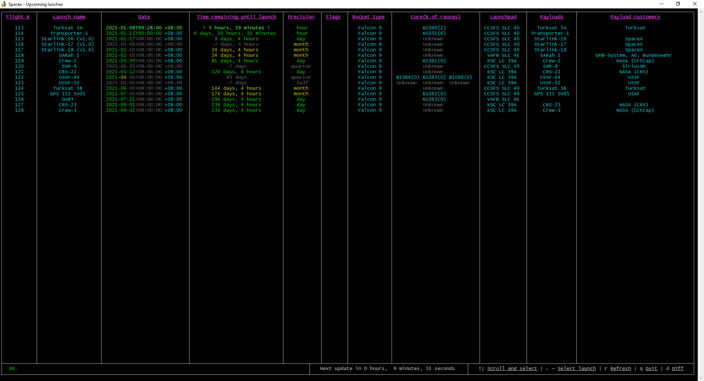
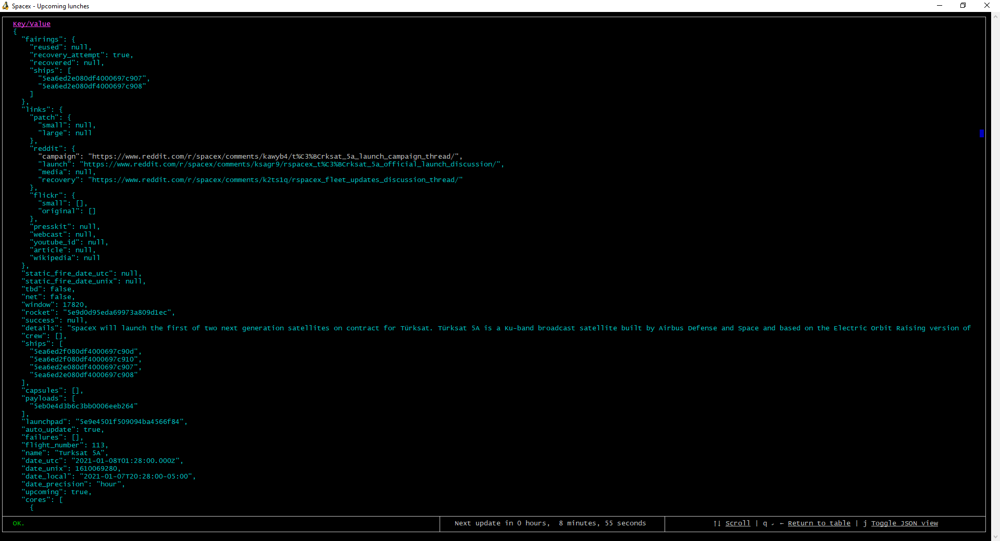
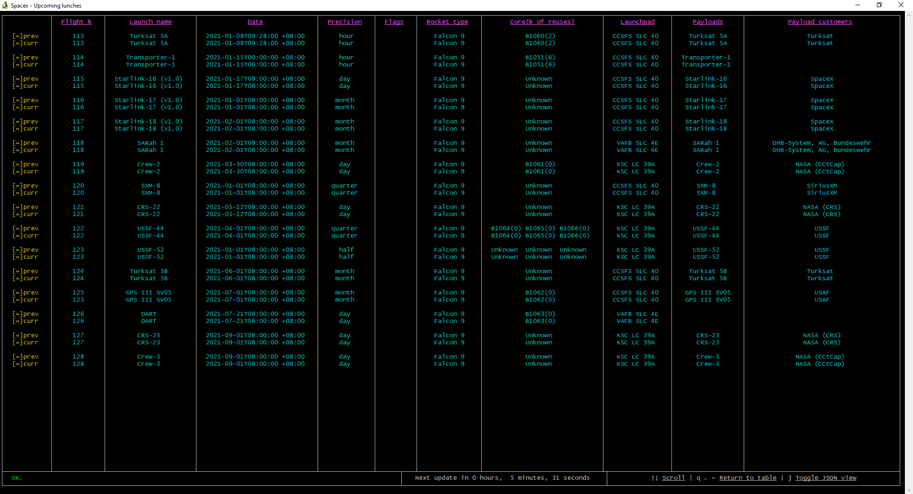

# SpaceX-cli
## View upcoming launches in the terminal

### Install with `npm install -g npc-strider/spacex-cli`

### ** I'm not including the proper `spacex.ico` in my releases to prevent trademark infringement :/ sorry. Add your own spacex logo in the npm directory: `npm\node_modules\spacex-cli` **



*You may notice that  falcon heavy launch shows as falcon 9, but that appears to be due to the API. Doesn't appear like this now.

```
Usage:
    spacex-cli
    spacex-cli [-a <polling interval>] | [-h] | [-s <polling interval>] | [-d] | [-b] | [-v] | [-p <appdir>] | [-n <time remaining>] | [-g <time remaining>]
    spacex-cli [--api_refresh=<polling interval>] | [--help] | [--screen_refresh=<polling interval>] | [--dump] | [--blink] | [--archive] | [--path=<appdir>] | [--notify_time=<time remaining>] | [--highlight_time=<time remaining>]

Options:
    -h, --help              Show this help information.
    -s, --screen_refresh    Screen refresh interval in milliseconds. How often time-based information updates [default: 1000]
    -a, --api_refresh       API refresh interval in milliseconds. How often we poll the api for new/updated information. Please don't use small values! [default: 600000]
    -c, --color             Print with color [default: true]
    -d, --dump              Non-interactive mode - dumps the main launches table [default: false]
    -b, --blink             Blink for close launches. This argument exists because I know some people hate blink [default: false]
    -v, --archive           Archive launch data when changed [default: false]
    -p, --path              Application directory [default: ~/.spacexcli]
    -n, --notify_time       At this amount of seconds remaining until launch, send a notification [default: 5400]
    -g, --highlight_time    At this amount of seconds remaining until launch, highlight the row in the table view [default: 86400]
```
This is an enhanced version of a basic CLI bash script I was using.

Because the bash script was based on the v3 [spacexdata](https://github.com/r-spacex/SpaceX-API) api, I was forced to upgrade it to use the new v4 api. 

So I decided to not just upgrade the bash script to use the new api, but also add some new features and more interactibility. 

The cli isn't pretty like some others, but I think it's quite dense in relevant information.

## More screenshots
---
View raw response\


View differences in data (You'll be notified as well when the data changes)\
You can also view the differences (which includes data not in the table) in JSON form.\


## Changelog
---
| Date | Version | Changes |
| --- | --- | --- |
| 2021-01-08 | 1.0.0 | Initial release. |
| 2021-02-07 | 1.0.1 | Fix bug with diff where undefined cells would cause an error. |
| 2021-02-16 | 1.0.2 | Added temp/placeholder icon to fix notifications. Remember to add your own icon (not including originals to prevent trademark infringement) |